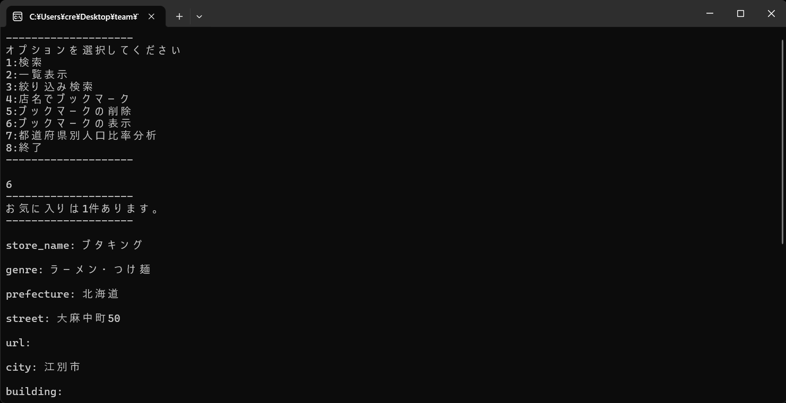

# 🍣レストランアプリ🍴

簡単なCLI操作お気に入りデータを管理・保存できる C++ アプリケーションです。UTF-8 文字列対応、JSON形式でのデータ保存を内部で行います。

---

## 📸 こんな感じのアプリ✨


---

## ✨ 主な機能
- 全国のレストラン検索
- お気に入りデータの登録・編集・削除
- コマンドラインベースの簡易 UI

おまけ
- 都道府県人口の表示
- 人口の表示に隠しコマンドがあるかも…
---

### 🔧 必要環境
- VisualStudio2022
- C++20 対応のコンパイラ(u8stringを使用しているため。)
- cereal ライブラリ（ヘッダオンリー）※本リポジトリに同梱済みのため、別途インストール不要

### 📦 セットアップ手順

```bash
# リポジトリをクローン
git clone https://github.com/OCA-25-SGCR2-SGW2/OpenDataGroup2.git
cd OpenDataGroup2

# ビルド（CMakeを使う場合）
mkdir build && cd build
cmake ..
make

# 実行
./Team2OpenDataApp

## 🔽 ダウンロード

最新版の実行ファイルは [Releasesページ](https://github.com/OCA-25-SGCR2-SGW2/OpenDataGroup2/releases) から取得できます。

**最新バージョン：** [v1.0.0](https://github.com/OCA-25-SGCR2-SGW2/OpenDataGroup2/releases)

**含まれるファイル：**
- `Team2OpenDataApp.exe`（Windows用実行ファイル）
- `Data/FavoritesList.json`（初期データファイル）
- `Data/restaurants.txt` (無料の全国レストランのオープンデータ)

※ C++の開発環境は不要です。ダウンロード後すぐに使えます。